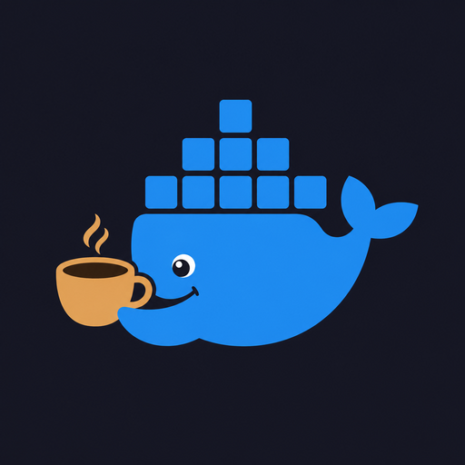
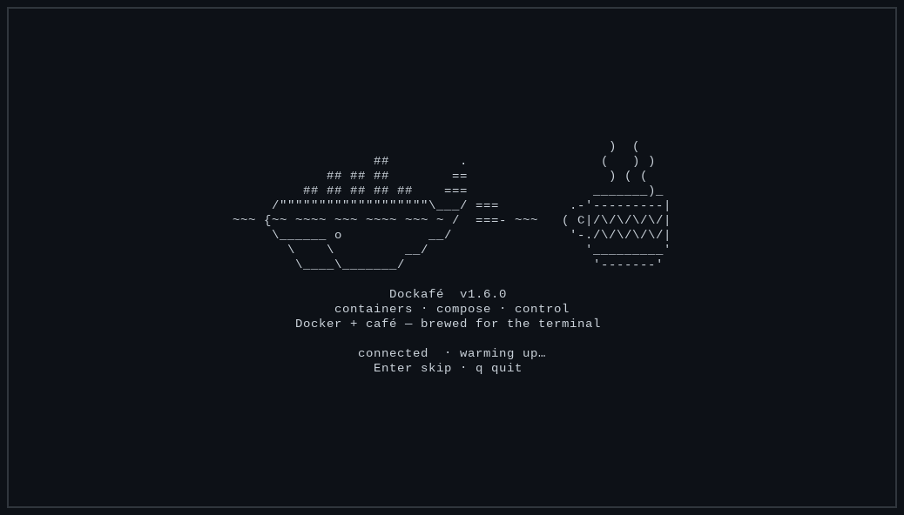
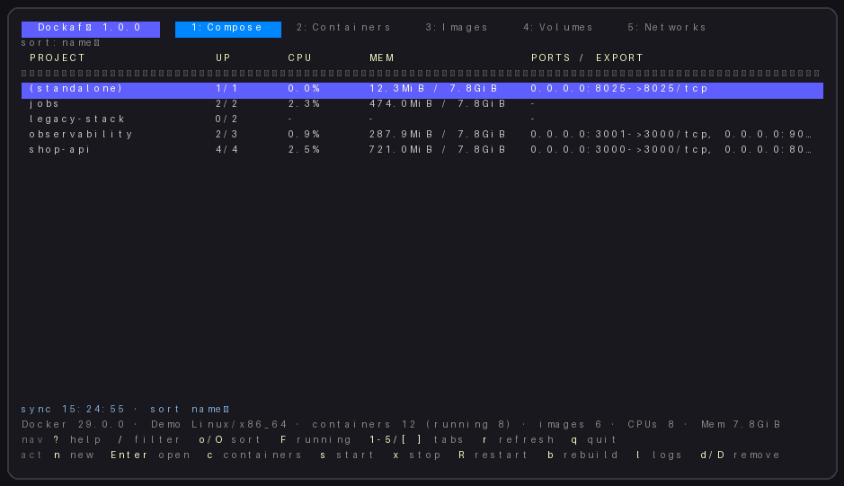
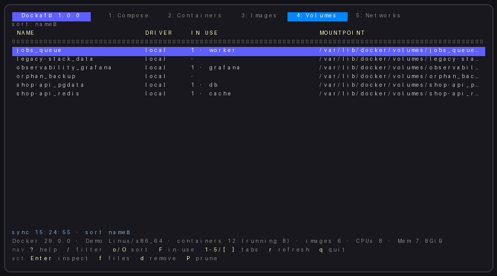
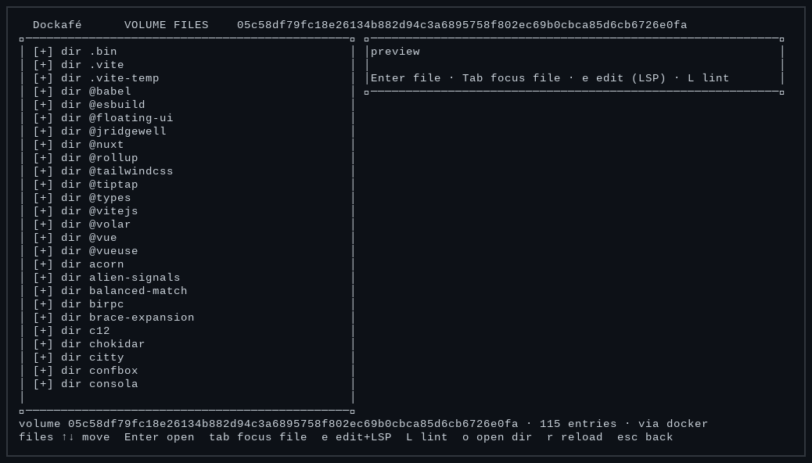

<p align="center">
  
</p>

<h1 align="center">Dockafé</h1>

<p align="center">
  <strong>Docker + café — brewed for the terminal</strong><br>
  Interactive TUI for Compose, containers, images, volumes, and networks
</p>

<p align="center">
  <a href="https://github.com/cooffeeRequired/dockafe/actions/workflows/ci.yml"></a>
  
  
  
</p>

<p align="center">
  <a href="#screenshots">Screenshots</a> ·
  <a href="#features">Features</a> ·
  <a href="#install">Install</a> ·
  <a href="#keybindings">Keybindings</a> ·
  <a href="#configuration">Configuration</a> ·
  <a href="#development">Development</a>
</p>

---

## Screenshots

### Splash

<p align="center">
  
</p>

### Compose

<p align="center">
  
</p>

### Volumes

<p align="center">
  
</p>

### Volume files

<p align="center">
  
</p>

> Screenshots use **demo data** (`dockafe --demo` / `make shots`) — not a live host.

---

## Features

| Area | What you get |
|------|----------------|
| **Tabs** | Compose, Containers, Images, Volumes, Networks, Settings |
| **Lifecycle** | Start, stop, restart, rebuild, remove, prune |
| **Logs** | Follow mode, text and regex search, colored output |
| **Graphs** | Live CPU/MEM history sparklines (`g` on Compose/Containers) |
| **Events** | Live Docker container events; OOM/die/unhealthy alerts (`E`) |
| **Remote hosts** | Switch Docker context / `--host` / in-app `H` (ssh/tcp/unix) |
| **Transfer** | Volume file copy/move ↔ local (`y/Y` download, `u/U` upload) |
| **Volume browser** | File tree, syntax highlighting, lint, Tab focus mode |
| **Editors** | Helix, Neovim, or VS Code (`--wait`) with LSP |
| **Filters** | `/` text filter, `o`/`O` sort, `F` running / in-use only |
| **Safe writes** | Confirm before saving volume files; remote Docker never writes local host paths |
| **Updater** | Startup check against GitHub Releases; `U` installs the latest binary |

---

## Install

### Requirements

- Go **1.22+** (to build)
- Running **Docker daemon** (`DOCKER_HOST` / `docker.sock`)
- `docker` **CLI** (compose up / rebuild)

### Platform support

| Platform | Status |
|----------|--------|
| **Linux** | Tested (Fedora + Docker) |
| **macOS** | Untested — may work (`?`) |
| **Windows** | Untested — may work (`?`) |

> [!NOTE]
> Dockafé is developed and verified on Linux. macOS and Windows are not tested yet; reports and fixes are welcome.

> [!WARNING]
> Access to the Docker socket is effectively **root** on the host. Only connect to daemons you trust.

### Build and run

```bash
git clone https://github.com/cooffeeRequired/dockafe.git
cd dockafe
make run
```

Sample data only (no Docker socket — safe for screenshots):

```bash
make demo          # ./dockafe --demo
make shots         # regenerate docs/assets/screenshot-*.png
```

```bash
make build        # ./dockafe
make install      # $(go env GOPATH)/bin/dockafe
make test vet fmt
```

```bash
go install github.com/cooffeeRequired/dockafe@latest
```

**Fedora:** use `make build` or `make install`. A Copr package may follow later.

---

## Keybindings

Press <kbd>?</kbd> inside the app for the full reference.

| Area | Keys |
|------|------|
| Tabs | <kbd>1</kbd>–<kbd>6</kbd>, <kbd>[</kbd> <kbd>]</kbd> |
| Filter / sort | <kbd>/</kbd>, <kbd>o</kbd>/<kbd>O</kbd>, <kbd>F</kbd> running / in-use |
| Settings | <kbd>6</kbd> hosts, updates, about |
| Lifecycle | <kbd>s</kbd> start, <kbd>x</kbd> stop, <kbd>R</kbd> restart, <kbd>b</kbd> rebuild, <kbd>d</kbd>/<kbd>D</kbd> remove |
| Logs | <kbd>l</kbd>, <kbd>/</kbd> find, <kbd>Ctrl</kbd>+<kbd>G</kbd> regex |
| Events | <kbd>E</kbd> live die/oom/health events |
| Hosts | <kbd>H</kbd> switch host · <kbd>a</kbd> add favorite · <kbd>s</kbd> save current · <kbd>d</kbd> delete |
| Multi-host | <kbd>M</kbd> side-by-side · <kbd>Tab</kbd> focus pane · <kbd>H</kbd> change focused host |
| Graphs | <kbd>g</kbd> CPU/MEM history (Compose / Containers) |
| Volume files | <kbd>f</kbd> tree, <kbd>y</kbd>/<kbd>Y</kbd> ↓ local, <kbd>u</kbd>/<kbd>U</kbd> ↑ volume |
| Quit | <kbd>q</kbd> |
| Update | <kbd>U</kbd> check / install from GitHub Releases |

---

## Configuration

| Variable | Purpose |
|----------|---------|
| `DOCKER_HOST` | Docker daemon address (overridden by `--host` / in-app `H`) |
| `DOCKAFE_EDITOR` / `EDITOR` / `VISUAL` | External editor for volume files. `code` / `codium` get `--wait` automatically |
| `DOCKAFE_BUSYBOX_IMAGE` | Helper image when host mount is unavailable (default `busybox:1.36.1`). Treat as trusted — it is pulled/run with the volume bind |

Saved favorites live in `~/.config/dockafe/hosts.json` (created via Hosts → <kbd>a</kbd> / <kbd>s</kbd>).

| File | Purpose |
|------|---------|
| `~/.config/dockafe/hosts.json` | Saved Docker host favorites |
| `~/.config/dockafe/settings.json` | Preferences (`remote_read_only`, default `true`) |
| `~/.config/dockafe/audit.log` | Append-only log of local mutating actions |

**Remote write lock:** on `ssh://` / `tcp://` hosts, start/stop/remove/prune/upload are blocked until you unlock **Settings → Remote write**. Volume download (`y`) stays allowed.

**Updates:** releases must ship `dockafe` **and** `dockafe.sha256`; install verifies SHA-256 before replacing the binary (`make checksum` locally).

```bash
dockafe --host ssh://user@podnikam.eu
dockafe --host tcp://192.168.1.10:2375
```

### Volume file access

- **Local** readable mountpoint → `via host` (paths are resolved; symlinks that escape the mount are rejected)
- **Remote** daemon or locked mount → `busybox` helper → `via docker`
- Saving from the editor always asks for confirmation (edits happen on a temp copy first)

---

## Development

```bash
make test
make vet
make build
make checksum   # writes dockafe.sha256 for GitHub Releases
```

Optional Docker smoke test:

```bash
DOCKER_INTEGRATION=1 go test ./internal/docker -run Integration
```

CI runs `gofmt`, `go vet`, `go test`, and `go build` on every push and pull request. See [`.github/workflows/ci.yml`](.github/workflows/ci.yml).

---

## License

Released under the [MIT License](LICENSE).
